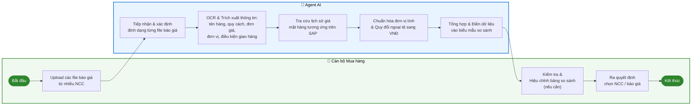
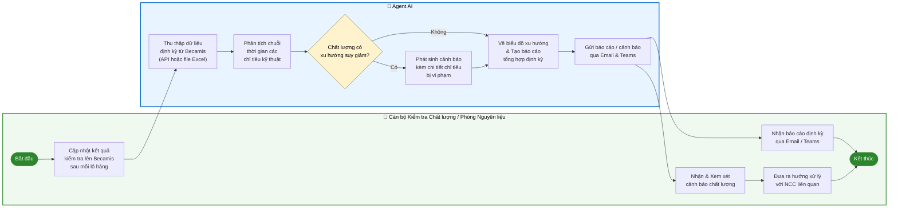
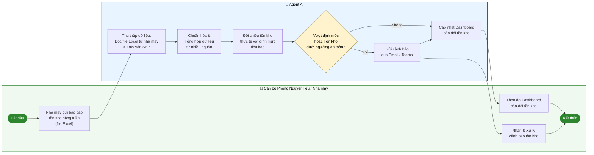

# Báo cáo Khảo sát Triển khai Hạng mục AI & RPA – Phase 2
**Khách hàng:** Hòa Phát Dung Quất (HPDQ)  
**Phạm vi:** Bộ phận Mua hàng & Phòng Nguyên liệu – 4 Agents đầu  
**Đơn vị thực hiện:** CMC

---

## 1. Agent Tổng hợp, Đánh giá Nhà cung cấp (NCC) / Nhà thầu

### 1.1 Quy trình nghiệp vụ (Swimlane)

---

### 1.2 Mô tả chi tiết từng bước

| STT | Tên bước | Thực hiện bởi | Mô tả chi tiết | Đầu vào | Đầu ra |
|-----|----------|---------------|----------------|---------|--------|
| 1 | Upload hồ sơ NCC | Cán bộ Mua hàng | Cán bộ tải lên hệ thống toàn bộ tài liệu của NCC cần đánh giá, bao gồm hồ sơ năng lực và Giấy ĐKKD | File PDF / Word / Hình ảnh hồ sơ năng lực & ĐKKD | Hồ sơ đã được lưu trên hệ thống |
| 2 | Tiếp nhận & phân loại hồ sơ | Agent AI | Agent xác định loại tài liệu (ĐKKD, hồ sơ năng lực, báo cáo tài chính...), ngôn ngữ tài liệu, và kiểm tra tính đầy đủ của bộ hồ sơ | Hồ sơ đã upload | Danh sách tài liệu được phân loại; thông báo thiếu hồ sơ (nếu có) |
| 3 | OCR & Trích xuất thông tin | Agent AI | Tự động nhận diện và trích xuất các thông tin quan trọng: tên doanh nghiệp, mã số thuế, địa chỉ, ngành nghề kinh doanh, vốn điều lệ, người đại diện pháp luật, năng lực sản xuất... | File tài liệu đã phân loại | Dữ liệu cấu trúc dạng JSON/bảng chứa thông tin đã trích xuất |
| 4 | Tra cứu lịch sử giao dịch SAP | Agent AI | Kết nối SAP để truy vấn lịch sử mua hàng với NCC: số lần giao dịch, giá trị hợp đồng, tỷ lệ giao hàng đúng hạn, lịch sử vi phạm hợp đồng (nếu có) | Mã số thuế / Tên NCC | Dữ liệu lịch sử giao dịch từ SAP |
| 5 | Quét Internet | Agent AI | Tìm kiếm và phân tích thông tin công khai về NCC: tin tức vi phạm pháp luật, thông báo nợ thuế, danh sách blacklist, vi phạm môi trường, các tranh chấp pháp lý | Tên doanh nghiệp, mã số thuế | Danh sách cảnh báo kèm đường link nguồn dẫn chứng |
| 6 | Dịch thuật tài liệu | Agent AI | Dịch sang tiếng Việt với NCC nước ngoài (Anh, Trung, Hàn, Nhật...) để chuẩn bị cho bước chấm điểm | Tài liệu NCC nước ngoài | Bản dịch tiếng Việt |
| 7 | Chấm điểm & Tổng hợp báo cáo | Agent AI | Áp dụng bộ tiêu chí chấm điểm của Hòa Phát để tính điểm từng hạng mục; tổng hợp toàn bộ thông tin thành báo cáo đánh giá theo biểu mẫu chuẩn | Dữ liệu trích xuất + lịch sử SAP + kết quả quét Internet | Báo cáo đánh giá NCC hoàn chỉnh theo biểu mẫu |
| 8 | Xem xét & phê duyệt | Cán bộ Mua hàng | Cán bộ đọc báo cáo, kiểm tra các cảnh báo, ra quyết định phê duyệt NCC vào danh sách hoặc yêu cầu bổ sung hồ sơ | Báo cáo đánh giá từ Agent | Quyết định phê duyệt / từ chối / yêu cầu bổ sung |

---

### 1.3 Dữ liệu đầu vào

| Nguồn dữ liệu | Định dạng | Mô tả |
|---------------|-----------|-------|
| Hồ sơ năng lực NCC | PDF / Word / Hình ảnh (JPEG, PNG) | Tài liệu giới thiệu năng lực sản xuất, kinh nghiệm, chứng chỉ chất lượng của NCC |
| Giấy đăng ký kinh doanh (ĐKKD) | PDF / Hình ảnh scan | Giấy phép kinh doanh do cơ quan nhà nước cấp |
| Lịch sử giao dịch | SAP (API / File xuất) | Dữ liệu mua hàng lịch sử: số PO, giá trị, thời gian giao hàng, đánh giá |
| Thông tin công khai | Internet (web crawl) | Tin tức, thông báo thuế, cổng thông tin pháp lý, danh sách blacklist |

---

### 1.4 Tài liệu Hòa Phát cần cung cấp cho CMC

| STT | Tài liệu cần cung cấp | Mục đích sử dụng | Ưu tiên |
|-----|-----------------------|------------------|---------|
| 1 | File mẫu Giấy ĐKKD của 3–5 NCC điển hình (gồm ít nhất 1 NCC nước ngoài) | Huấn luyện & kiểm thử module OCR | Cao |
| 2 | File mẫu Hồ sơ năng lực của 3–5 NCC (đa dạng định dạng) | Huấn luyện & kiểm thử module OCR | Cao |
| 3 | Biểu mẫu báo cáo đánh giá NCC hiện tại đang sử dụng | Thiết kế template đầu ra | Cao |
| 4 | Bảng tiêu chí chấm điểm NCC (các hạng mục, thang điểm, trọng số) | Cấu hình rule-based scoring engine | Cao |
| 5 | File xuất mẫu lịch sử giao dịch từ SAP (hoặc thông tin API SAP) | Thiết kế kết nối SAP | Cao |
| 6 | Danh sách các nguồn blacklist / website cần quét (nếu có danh sách cụ thể) | Cấu hình web crawler | Trung bình |

---

### 1.5 Output mong muốn

| STT | Đầu ra | Mô tả chi tiết |
|-----|--------|----------------|
| 1 | Báo cáo đánh giá NCC | Tài liệu hoàn chỉnh theo đúng biểu mẫu chuẩn của Hòa Phát, bao gồm điểm số từng hạng mục và điểm tổng |
| 2 | Danh sách cảnh báo rủi ro | Thông tin cảnh báo kèm đường link dẫn chứng khi phát hiện NCC có vi phạm pháp luật, nợ thuế hoặc thuộc blacklist |
| 3 | Bản dịch tiếng Việt | Bản dịch đầy đủ các tài liệu tiếng nước ngoài của NCC quốc tế |
| 4 | Thông báo thiếu hồ sơ | Danh sách tài liệu còn thiếu gửi tới cán bộ ngay sau khi upload (nếu bộ hồ sơ không đầy đủ) |

---
---

## 2. Agent So sánh Báo giá

### 2.1 Quy trình nghiệp vụ (Swimlane)

---

### 2.2 Mô tả chi tiết từng bước

| STT | Tên bước | Thực hiện bởi | Mô tả chi tiết | Đầu vào | Đầu ra |
|-----|----------|---------------|----------------|---------|--------|
| 1 | Upload file báo giá | Cán bộ Mua hàng | Cán bộ tải lên tất cả các file báo giá nhận được từ các NCC khác nhau cho cùng một yêu cầu mua hàng | Nhiều file báo giá (PDF, Excel, Word, ảnh) từ nhiều NCC | Các file được lưu trên hệ thống, sẵn sàng xử lý |
| 2 | Tiếp nhận & xác định định dạng | Agent AI | Agent phân tích từng file đầu vào, xác định định dạng (PDF native, PDF scan, Excel, ảnh), ngôn ngữ và cấu trúc bảng giá | Các file báo giá đã upload | Danh sách file kèm metadata (định dạng, ngôn ngữ, số trang) |
| 3 | OCR & Trích xuất thông tin | Agent AI | Nhận diện và trích xuất toàn bộ dữ liệu dạng bảng: tên hàng hóa, mã hàng, quy cách kỹ thuật, đơn vị tính, đơn giá, số lượng, điều kiện giao hàng, điều kiện thanh toán | File báo giá đã xác định định dạng | Dữ liệu cấu trúc theo từng NCC |
| 4 | Tra cứu lịch sử giá SAP | Agent AI | Với từng mặt hàng trong báo giá, agent truy vấn SAP để lấy giá đã mua trong các lần giao dịch gần nhất làm cơ sở tham chiếu | Tên / mã hàng hóa | Lịch sử giá mua từ SAP (giá min, max, trung bình) |
| 5 | Chuẩn hóa đơn vị & Quy đổi tiền tệ | Agent AI | Quy đổi tất cả đơn vị tính về chuẩn chung (ví dụ: tấn, kg, lít); chuyển đổi ngoại tệ (USD, EUR, RMB, JPY...) sang VNĐ theo tỷ giá hiện hành | Dữ liệu thô từng NCC | Dữ liệu đã chuẩn hóa, đồng đơn vị, đồng tiền tệ |
| 6 | Điền vào biểu mẫu so sánh | Agent AI | Tổng hợp toàn bộ dữ liệu đã chuẩn hóa vào biểu mẫu so sánh chuẩn của Hòa Phát; đồng thời hiển thị cột tham chiếu giá lịch sử SAP để dễ đối chiếu | Dữ liệu đã chuẩn hóa + lịch sử giá SAP | Bảng so sánh báo giá hoàn chỉnh |
| 7 | Kiểm tra & Ra quyết định | Cán bộ Mua hàng | Cán bộ đọc bảng so sánh, hiệu chỉnh thủ công nếu cần (ghi chú, điều kiện đặc biệt), sau đó ra quyết định lựa chọn NCC | Bảng so sánh từ Agent | Quyết định chọn NCC, lưu vào hệ thống |

---

### 2.3 Dữ liệu đầu vào

| Nguồn dữ liệu | Định dạng | Mô tả |
|---------------|-----------|-------|
| Báo giá từ các NCC | PDF / Excel / Word / Hình ảnh (đa dạng, không đồng nhất) | Báo giá của từng NCC cho cùng một yêu cầu mua hàng |
| Lịch sử giá mặt hàng | SAP (API / File xuất) | Giá đã mua trong các lần giao dịch gần nhất theo từng mã hàng |
| Tỷ giá hối đoái | API tỷ giá ngân hàng (VCB, SBV) hoặc nhập thủ công | Tỷ giá tại thời điểm so sánh để quy đổi ngoại tệ |

---

### 2.4 Tài liệu Hòa Phát cần cung cấp cho CMC

| STT | Tài liệu cần cung cấp | Mục đích sử dụng | Ưu tiên |
|-----|-----------------------|------------------|---------|
| 1 | 5–10 file báo giá mẫu đa dạng định dạng (bao gồm file có nhiều tiền tệ, nhiều đơn vị) | Kiểm thử khả năng OCR và trích xuất dữ liệu phức tạp | Cao |
| 2 | Biểu mẫu so sánh báo giá chuẩn hiện tại đang dùng (file Excel) | Thiết kế template đầu ra | Cao |
| 3 | Bảng quy đổi đơn vị tính nội bộ (nếu có quy chuẩn riêng) | Cấu hình module chuẩn hóa đơn vị | Trung bình |
| 4 | File xuất mẫu lịch sử giá từ SAP (hoặc thông tin API SAP) | Thiết kế kết nối SAP | Cao |
| 5 | Quy định về tỷ giá sử dụng (ngân hàng nào, thời điểm nào trong ngày) | Cấu hình module quy đổi ngoại tệ | Trung bình |

---

### 2.5 Output mong muốn

| STT | Đầu ra | Mô tả chi tiết |
|-----|--------|----------------|
| 1 | Bảng so sánh báo giá hoàn chỉnh | File Excel theo đúng biểu mẫu chuẩn của Hòa Phát, đã chuẩn hóa toàn bộ đơn vị và tiền tệ, kèm cột giá lịch sử SAP để tham chiếu |
| 2 | Cảnh báo giá bất thường | Đánh dấu (highlight) tự động các dòng có giá báo cao/thấp bất thường so với lịch sử mua SAP (ví dụ: chênh lệch > 15%) |
| 3 | Gợi ý lựa chọn | Tóm tắt NCC có giá tốt nhất theo từng tiêu chí (giá thấp nhất, điều kiện thanh toán tốt nhất...) |

---
---

## 3. Agent Báo cáo Tình hình Mua Nguyên liệu (Theo dõi Chất lượng)

### 3.1 Quy trình nghiệp vụ (Swimlane)

---

### 3.2 Mô tả chi tiết từng bước

| STT | Tên bước | Thực hiện bởi | Mô tả chi tiết | Đầu vào | Đầu ra |
|-----|----------|---------------|----------------|---------|--------|
| 1 | Cập nhật kết quả kiểm tra | Cán bộ Kiểm tra CL | Sau mỗi lô hàng nhập về, cán bộ nhập kết quả kiểm tra các chỉ tiêu kỹ thuật (>10 chỉ tiêu) lên hệ thống Becamis | Kết quả kiểm tra theo lô hàng | Dữ liệu chất lượng được lưu trên Becamis |
| 2 | Thu thập dữ liệu định kỳ | Agent AI | Agent tự động kết nối Becamis (qua API hoặc đọc file Excel xuất) theo lịch định kỳ để lấy dữ liệu mới nhất | Becamis API / File Excel xuất từ Becamis | Dữ liệu chất lượng cấu trúc theo thời gian |
| 3 | Phân tích chuỗi thời gian | Agent AI | Với mỗi chỉ tiêu kỹ thuật theo từng NCC/mặt hàng, agent phân tích xu hướng biến động theo thời gian (tuần/tháng/quý) | Dữ liệu chất lượng lịch sử | Kết quả phân tích xu hướng từng chỉ tiêu |
| 4 | Phán định xu hướng chất lượng | Agent AI | So sánh kết quả phân tích với bộ rule định nghĩa "chất lượng xấu đi" do Hòa Phát cung cấp. Ví dụ: giảm liên tiếp 3 lần, lệch khỏi ngưỡng X%... | Kết quả phân tích + bộ rule nghiệp vụ | Flag: cảnh báo (Yes/No) cho từng chỉ tiêu |
| 5 | Tạo cảnh báo chất lượng | Agent AI | Khi phát hiện xu hướng xấu, agent tạo nội dung cảnh báo chi tiết: chỉ tiêu bị vi phạm, NCC liên quan, dữ liệu gần nhất, mức độ suy giảm | Flag cảnh báo + dữ liệu chi tiết | Nội dung cảnh báo kèm biểu đồ minh họa |
| 6 | Vẽ biểu đồ & Tạo báo cáo | Agent AI | Tự động vẽ biểu đồ xu hướng (line chart / control chart) cho từng chỉ tiêu; tổng hợp thành báo cáo định kỳ (tuần/tháng) | Dữ liệu phân tích + cảnh báo | Báo cáo tổng hợp dạng PDF/Excel kèm biểu đồ |
| 7 | Gửi báo cáo / cảnh báo | Agent AI | Tự động gửi báo cáo định kỳ hoặc cảnh báo ngay lập tức tới danh sách người được phân quyền qua Email và Microsoft Teams | Báo cáo + cảnh báo đã tạo | Thông báo tới cán bộ phụ trách |
| 8 | Xem xét & Xử lý | Cán bộ CL / Nguyên liệu | Cán bộ đọc báo cáo/cảnh báo, đánh giá mức độ ảnh hưởng và quyết định hướng xử lý với NCC (yêu cầu giải trình, giảm đơn hàng, tạm dừng hợp tác...) | Báo cáo từ Agent | Quyết định xử lý với NCC |

---

### 3.3 Dữ liệu đầu vào

| Nguồn dữ liệu | Định dạng | Mô tả |
|---------------|-----------|-------|
| Kết quả kiểm tra chất lượng | Becamis (API) hoặc File Excel xuất định kỳ | Dữ liệu >10 chỉ tiêu kỹ thuật theo từng lô hàng nhập, có timestamp |
| Bộ tiêu chuẩn chất lượng | File Excel / Tài liệu kỹ thuật (do HP cung cấp) | Ngưỡng cho phép của từng chỉ tiêu theo từng loại nguyên liệu / NCC |
| Bộ rule "xu hướng xấu" | Cấu hình nghiệp vụ (do HP định nghĩa) | Quy tắc xác định khi nào được coi là xu hướng chất lượng suy giảm |

---

### 3.4 Tài liệu Hòa Phát cần cung cấp cho CMC

| STT | Tài liệu cần cung cấp | Mục đích sử dụng | Ưu tiên |
|-----|-----------------------|------------------|---------|
| 1 | File dữ liệu mẫu xuất từ Becamis (tối thiểu 6 tháng lịch sử) | Phân tích cấu trúc dữ liệu, kiểm thử module phân tích xu hướng | Cao |
| 2 | Tài liệu API hoặc hướng dẫn xuất dữ liệu từ Becamis | Thiết kế cơ chế lấy dữ liệu tự động | Cao |
| 3 | Danh mục chỉ tiêu kỹ thuật cần theo dõi và ngưỡng cho phép của từng chỉ tiêu | Cấu hình module phân tích và cảnh báo | Cao |
| 4 | Định nghĩa nghiệp vụ "xu hướng chất lượng xấu đi" (rule cụ thể, có thể là văn bản nội bộ) | Cấu hình rule engine | Cao |
| 5 | Biểu mẫu / mẫu báo cáo chất lượng hiện tại đang sử dụng | Thiết kế template báo cáo đầu ra | Trung bình |
| 6 | Mẫu biểu đồ xu hướng mong muốn (nếu có mẫu cụ thể) | Thiết kế Data Visualization | Trung bình |

---

### 3.5 Output mong muốn

| STT | Đầu ra | Mô tả chi tiết |
|-----|--------|----------------|
| 1 | Báo cáo xu hướng chất lượng định kỳ | Báo cáo tổng hợp (PDF/Excel) thể hiện biến động các chỉ tiêu chất lượng theo tuần/tháng/quý, phân tách theo NCC và mặt hàng |
| 2 | Biểu đồ xu hướng trực quan | Biểu đồ line chart / control chart cho từng chỉ tiêu kỹ thuật, có đường ngưỡng cảnh báo |
| 3 | Thông báo cảnh báo chất lượng | Cảnh báo tức thì qua Email / Teams khi phát hiện xu hướng suy giảm, kèm tên NCC, tên chỉ tiêu, dữ liệu gần nhất và mức độ suy giảm |

---
---

## 4. Agent Theo dõi Hàng Tồn kho

### 4.1 Quy trình nghiệp vụ (Swimlane)

---

### 4.2 Mô tả chi tiết từng bước

| STT | Tên bước | Thực hiện bởi | Mô tả chi tiết | Đầu vào | Đầu ra |
|-----|----------|---------------|----------------|---------|--------|
| 1 | Gửi báo cáo tồn kho | Cán bộ Nhà máy | Hàng tuần, cán bộ từng nhà máy gửi file Excel báo cáo tồn kho lên nhóm Teams/Email chung, ghi nhận lượng sử dụng và lượng tồn tại kho nhà máy | File Excel tồn kho theo template chuẩn | File Excel được lưu trên hệ thống hoặc SharePoint |
| 2 | Thu thập dữ liệu đa nguồn | Agent AI | Agent tự động đọc file Excel từ các nhà máy (qua SharePoint / Teams) VÀ đồng thời truy vấn dữ liệu tồn kho tổng từ SAP | File Excel nhà máy + SAP API | Dữ liệu thô từ tất cả các nguồn |
| 3 | Chuẩn hóa & Tổng hợp | Agent AI | Chuẩn hóa tên hàng hóa, đơn vị tính từ các nhà máy khác nhau; tổng hợp thành kho dữ liệu thống nhất; đối chiếu số liệu giữa Excel nhà máy và SAP để phát hiện sai lệch | Dữ liệu thô đa nguồn | Bộ dữ liệu tồn kho thống nhất + danh sách sai lệch (nếu có) |
| 4 | Đối chiếu với định mức | Agent AI | So sánh lượng tồn kho thực tế và mức tiêu hao thực tế với định mức tiêu hao do Phòng Công nghệ cung cấp; tính số ngày tồn kho còn lại | Dữ liệu tồn kho + Bảng định mức tiêu hao | Báo cáo cân đối: tồn kho thực tế vs định mức, số ngày đủ dùng |
| 5 | Phán định rủi ro | Agent AI | Xác định các mặt hàng có nguy cơ: tồn kho dưới ngưỡng an toàn, mức tiêu hao tuần tăng đột biến so với định mức, dự báo hết hàng trước thời điểm đặt hàng tiếp theo | Báo cáo cân đối | Danh sách mặt hàng rủi ro kèm mức độ |
| 6 | Gửi cảnh báo | Agent AI | Khi phát hiện rủi ro, agent gửi ngay cảnh báo tới người phụ trách qua Email và Microsoft Teams, kèm chi tiết mặt hàng, lý do cảnh báo, số liệu tồn kho hiện tại | Danh sách mặt hàng rủi ro | Thông báo cảnh báo qua Email / Teams |
| 7 | Cập nhật Dashboard | Agent AI | Tự động cập nhật Dashboard tổng quan sau mỗi chu kỳ tổng hợp: hiển thị tồn kho thực tế, định mức, % sử dụng, trạng thái (an toàn / cảnh báo / nguy hiểm) | Dữ liệu đã cân đối | Dashboard tồn kho cập nhật |
| 8 | Theo dõi & Xử lý | Cán bộ Phòng Nguyên liệu | Cán bộ theo dõi Dashboard và xử lý các cảnh báo: lên kế hoạch đặt hàng bổ sung, điều phối nội bộ giữa các nhà máy | Dashboard + Cảnh báo | Quyết định đặt hàng / điều phối |

---

### 4.3 Dữ liệu đầu vào

| Nguồn dữ liệu | Định dạng | Mô tả |
|---------------|-----------|-------|
| Báo cáo tồn kho nhà máy | File Excel (hàng tuần) | Lượng nhập, lượng xuất, lượng tồn tại kho nhà máy theo từng mặt hàng |
| Tồn kho tổng | SAP (API / File xuất) | Dữ liệu tồn kho tổng từ hệ thống ERP SAP |
| Định mức tiêu hao | File Excel / Tài liệu kỹ thuật | Bảng định mức tiêu hao nguyên/phụ liệu theo từng dây chuyền sản xuất, do Phòng Công nghệ cung cấp |

---

### 4.4 Tài liệu Hòa Phát cần cung cấp cho CMC

| STT | Tài liệu cần cung cấp | Mục đích sử dụng | Ưu tiên |
|-----|-----------------------|------------------|---------|
| 1 | File Excel báo cáo tồn kho mẫu từ 2–3 nhà máy khác nhau | Phân tích cấu trúc, kiểm thử khả năng đọc đa định dạng | Cao |
| 2 | Bảng danh mục định mức tiêu hao nguyên vật liệu chuẩn | Cấu hình module đối chiếu và phán định rủi ro | Cao |
| 3 | File xuất mẫu tồn kho tổng từ SAP (hoặc thông tin API SAP) | Thiết kế kết nối SAP | Cao |
| 4 | Quy định ngưỡng cảnh báo tồn kho (số ngày tồn kho tối thiểu, % lệch định mức cho phép) | Cấu hình rule cảnh báo | Cao |
| 5 | Danh sách người nhận cảnh báo theo từng mặt hàng / nhà máy | Cấu hình hệ thống phân quyền thông báo | Trung bình |
| 6 | Mẫu Dashboard tồn kho mong muốn (nếu có yêu cầu cụ thể về bố cục) | Thiết kế giao diện Dashboard | Thấp |

---

### 4.5 Output mong muốn

| STT | Đầu ra | Mô tả chi tiết |
|-----|--------|----------------|
| 1 | Dashboard theo dõi tồn kho | Giao diện trực quan hiển thị tồn kho thực tế vs định mức, số ngày đủ dùng, trạng thái từng mặt hàng (xanh / vàng / đỏ), cập nhật tự động sau mỗi chu kỳ |
| 2 | Cảnh báo tồn kho bất thường | Thông báo tức thì qua Email / Teams khi: tồn kho dưới ngưỡng an toàn, mức tiêu hao tuần tăng đột biến > ngưỡng quy định so với định mức |
| 3 | Báo cáo cân đối tồn kho định kỳ | Báo cáo tổng hợp tuần/tháng so sánh tồn kho thực tế vs định mức, gồm danh sách mặt hàng cần đặt hàng bổ sung |
| 4 | Cảnh báo sai lệch dữ liệu | Thông báo khi phát hiện số liệu tồn kho giữa báo cáo Excel nhà máy và SAP có sai lệch bất thường |
