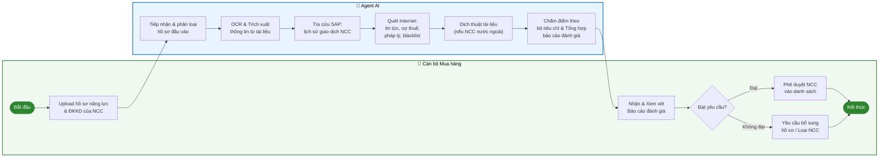
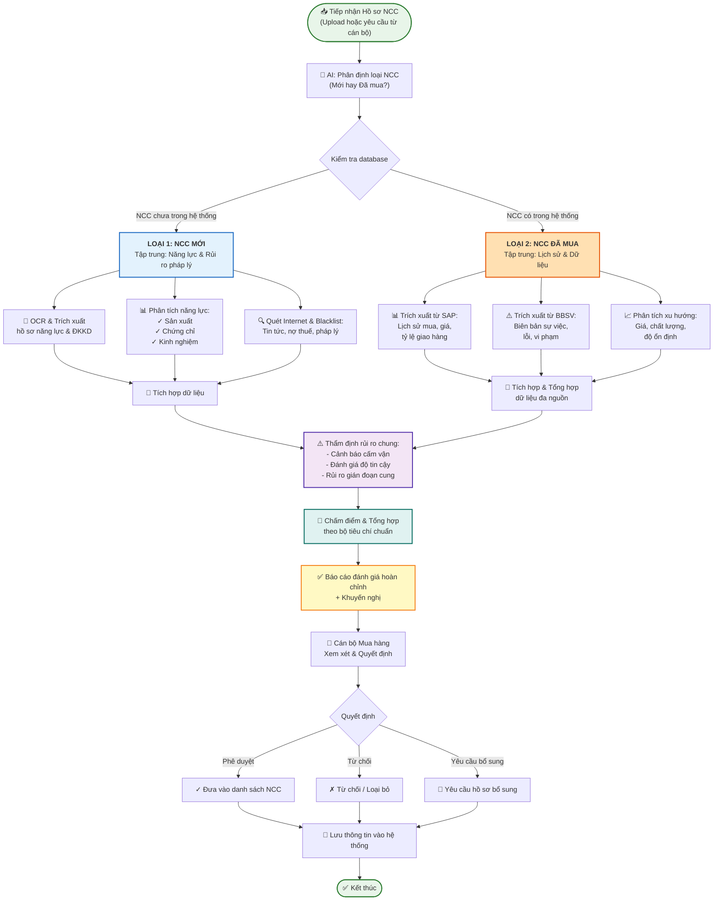

# Báo cáo Khảo sát Triển khai Hạng mục AI & RPA – Phase 2
**Khách hàng:** Hòa Phát Dung Quất (HPDQ)  
**Phạm vi:** Bộ phận Mua hàng & Phòng Nguyên liệu – 4 Agents đầu  
**Đơn vị thực hiện:** CMC

---

## 1. Agent Tổng hợp, Đánh giá Nhà cung cấp (NCC) / Nhà thầu

### 1.1 Quy trình nghiệp vụ (Swimlane)



---

### 1.2 Mô tả chi tiết từng bước

| STT | Tên bước | Thực hiện bởi | Mô tả chi tiết | Đầu vào | Đầu ra |
|-----|----------|---------------|----------------|---------|--------|
| 1 | Upload hồ sơ NCC | Cán bộ Mua hàng | Cán bộ tải lên hệ thống toàn bộ tài liệu của NCC cần đánh giá, bao gồm hồ sơ năng lực và Giấy ĐKKD | File PDF / Word / Hình ảnh hồ sơ năng lực & ĐKKD | Hồ sơ đã được lưu trên hệ thống |
| 2 | Tiếp nhận & phân loại hồ sơ | Agent AI | Agent xác định loại tài liệu (ĐKKD, hồ sơ năng lực, báo cáo tài chính...), ngôn ngữ tài liệu, và kiểm tra tính đầy đủ của bộ hồ sơ | Hồ sơ đã upload | Danh sách tài liệu được phân loại; thông báo thiếu hồ sơ (nếu có) |
| 3 | OCR & Trích xuất thông tin | Agent AI | Tự động nhận diện và trích xuất các thông tin quan trọng: tên doanh nghiệp, mã số thuế, địa chỉ, ngành nghề kinh doanh, vốn điều lệ, người đại diện pháp luật, năng lực sản xuất... | File tài liệu đã phân loại | Dữ liệu cấu trúc dạng JSON/bảng chứa thông tin đã trích xuất |
| 4 | Tra cứu lịch sử giao dịch SAP | Agent AI | Kết nối SAP để truy vấn lịch sử mua hàng với NCC: số lần giao dịch, giá trị hợp đồng, tỷ lệ giao hàng đúng hạn, lịch sử vi phạm hợp đồng (nếu có) | Mã số thuế / Tên NCC | Dữ liệu lịch sử giao dịch từ SAP |
| 5 | Quét Internet | Agent AI | Tìm kiếm và phân tích thông tin công khai về NCC: tin tức vi phạm pháp luật, thông báo nợ thuế, danh sách blacklist, vi phạm môi trường, các tranh chấp pháp lý | Tên doanh nghiệp, mã số thuế | Danh sách cảnh báo kèm đường link nguồn dẫn chứng |
| 6 | Dịch thuật tài liệu | Agent AI | Dịch sang tiếng Việt với NCC nước ngoài (Anh, Trung, Hàn, Nhật...) để chuẩn bị cho bước chấm điểm | Tài liệu NCC nước ngoài | Bản dịch tiếng Việt |
| 7 | Chấm điểm & Tổng hợp báo cáo | Agent AI | Áp dụng bộ tiêu chí chấm điểm của Hòa Phát để tính điểm từng hạng mục; tổng hợp toàn bộ thông tin thành báo cáo đánh giá theo biểu mẫu chuẩn | Dữ liệu trích xuất + lịch sử SAP + kết quả quét Internet | Báo cáo đánh giá NCC hoàn chỉnh theo biểu mẫu |
| 8 | Xem xét & phê duyệt | Cán bộ Mua hàng | Cán bộ đọc báo cáo, kiểm tra các cảnh báo, ra quyết định phê duyệt NCC vào danh sách hoặc yêu cầu bổ sung hồ sơ | Báo cáo đánh giá từ Agent | Quyết định phê duyệt / từ chối / yêu cầu bổ sung |

---

### 1.3 Dữ liệu đầu vào

| Nguồn dữ liệu | Định dạng | Mô tả |
|---------------|-----------|-------|
| Hồ sơ năng lực NCC | PDF / Word / Hình ảnh (JPEG, PNG) | Tài liệu giới thiệu năng lực sản xuất, kinh nghiệm, chứng chỉ chất lượng của NCC |
| Giấy đăng ký kinh doanh (ĐKKD) | PDF / Hình ảnh scan | Giấy phép kinh doanh do cơ quan nhà nước cấp |
| Lịch sử giao dịch | SAP (API / File xuất) | Dữ liệu mua hàng lịch sử: số PO, giá trị, thời gian giao hàng, đánh giá |
| Thông tin công khai | Internet (web crawl) | Tin tức, thông báo thuế, cổng thông tin pháp lý, danh sách blacklist |

---

### 1.4 Tài liệu Hòa Phát cần cung cấp cho CMC

| STT | Tài liệu cần cung cấp | Mục đích sử dụng | Ưu tiên |
|-----|-----------------------|------------------|---------|
| 1 | File mẫu Giấy ĐKKD của 3–5 NCC điển hình (gồm ít nhất 1 NCC nước ngoài) | Huấn luyện & kiểm thử module OCR | Cao |
| 2 | File mẫu Hồ sơ năng lực của 3–5 NCC (đa dạng định dạng) | Huấn luyện & kiểm thử module OCR | Cao |
| 3 | Biểu mẫu báo cáo đánh giá NCC hiện tại đang sử dụng | Thiết kế template đầu ra | Cao |
| 4 | Bảng tiêu chí chấm điểm NCC (các hạng mục, thang điểm, trọng số) | Cấu hình rule-based scoring engine | Cao |
| 5 | File xuất mẫu lịch sử giao dịch từ SAP (hoặc thông tin API SAP) | Thiết kế kết nối SAP | Cao |
| 6 | Danh sách các nguồn blacklist / website cần quét (nếu có danh sách cụ thể) | Cấu hình web crawler | Trung bình |

---

### 1.5 Output mong muốn

| STT | Đầu ra | Mô tả chi tiết |
|-----|--------|----------------|
| 1 | Báo cáo đánh giá NCC | Tài liệu hoàn chỉnh theo đúng biểu mẫu chuẩn của Hòa Phát, bao gồm điểm số từng hạng mục và điểm tổng |
| 2 | Danh sách cảnh báo rủi ro | Thông tin cảnh báo kèm đường link dẫn chứng khi phát hiện NCC có vi phạm pháp luật, nợ thuế hoặc thuộc blacklist |
| 3 | Bản dịch tiếng Việt | Bản dịch đầy đủ các tài liệu tiếng nước ngoài của NCC quốc tế |
| 4 | Thông báo thiếu hồ sơ | Danh sách tài liệu còn thiếu gửi tới cán bộ ngay sau khi upload (nếu bộ hồ sơ không đầy đủ) |

---

## 1.6 Luồng Nghiệp vụ Thống nhất: Agent AI Đánh giá NCC (Cả NCC Mới & NCC Đã Mua)

### Tổng quan

Một Agent duy nhất xử lý **cả hai loại** đánh giá NCC:
- **Loại 1**: NCC mới (chưa có trong hệ thống) → Tập trung vào **thẩm định năng lực & rủi ro pháp lý**
- **Loại 2**: NCC đã mua (có lịch sử) → Tập trung vào **phân tích dữ liệu lịch sử & xu hướng**

Agent tự động **phân định loại** NCC khi tiếp nhận, sau đó áp dụng **các bước phù hợp** cho từng trường hợp.

### Luồng Quy Trình Chính



---

### Mô tả Chi Tiết: Loại 1 (NCC Mới)

#### Ngữ cảnh hiện tại
- Cán bộ Mua hàng phải **tìm kiếm thông tin thủ công** (gọi điện, email, duyệt web)
- **Điền biểu mẫu thủ công** từ tài liệu được gửi
- **Ít hoặc không kiểm tra rủi ro**: Không tra cứu blacklist, lịch sử vi phạm pháp luật

#### Quy trình chi tiết - Loại 1:

| Bước | Thực hiện bởi | Mô tả | Đầu vào | Đầu ra |
|------|---|---|---|---|
| **1. Upload hồ sơ** | Cán bộ Mua hàng | Tải lên hồ sơ năng lực & ĐKKD của NCC mới | File PDF/Word/Hình ảnh | Hồ sơ lưu trên hệ thống |
| **2. Phân loại & Kiểm soát đầy đủ** | AI | Xác định loại tài liệu, ngôn ngữ; kiểm tra thiếu hồ sơ | Hồ sơ đã upload | Danh sách thiếu hồ sơ (nếu có) |
| **3. OCR & Trích xuất** | AI | Nhận diện & trích xuất: tên, MST, địa chỉ, vốn, ngành, năng lực, chứng chỉ | File tài liệu | Dữ liệu cấu trúc (JSON/bảng) |
| **4. Phân tích năng lực sản xuất** | AI | Đánh giá: Sản xuất, chứng chỉ chất lượng, kinh nghiệm, tài nguyên con người | Dữ liệu trích xuất | Điểm số từng hạng mục năng lực |
| **5. Quét Internet & Tra cứu** | AI | Tìm tin tức, tra cứu: blacklist, nợ thuế, tranh chấp pháp lý, rủi ro cấm vận | Tên NCC, MST | Danh sách cảnh báo + mức độ rủi ro |
| **6. Dịch tài liệu (nếu cần)** | AI | Dịch sang Tiếng Việt (nếu NCC nước ngoài) | Tài liệu tiếng nước ngoài | Bản dịch Tiếng Việt |
| **7. Chấm điểm & Tổng hợp** | AI | Áp dụng bộ tiêu chí chấm điểm chuẩn; tổng hợp báo cáo | Dữ liệu + cảnh báo | Báo cáo đánh giá + khuyến nghị |
| **8. Xem xét & Phê duyệt** | Cán bộ Mua hàng | Đọc báo cáo, quyết định phê duyệt hay yêu cầu bổ sung | Báo cáo từ AI | Quyết định chính thức |

#### Lợi ích AI mang lại - Loại 1:

| Chức năng | Trước (Thủ công) | Sau (AI) | Lợi ích |
|---|---|---|---|
| Trích xuất thông tin | 30-60 phút/NCC | <5 phút | ⏱️ Tiết kiệm 85-90% thời gian |
| Phân tích năng lực | Chủ quan | Khách quan theo rule chuẩn | 🎯 Đánh giá nhất quán, khoa học |
| Thẩm định rủi ro pháp lý | Không hoặc chỉ kinh nghiệm | Quét 50+ nguồn, tra cứu blacklist | 🛡️ Phát hiện 100% cảnh báo công khai |
| Dịch tài liệu | Thuê ngoài (2-3 ngày, đắt) | Tự động (5-10 phút) | 💰 Giảm 90% chi phí |
| Báo cáo tổng hợp | Soạn thủ công, không nhất quán | Tự động, template chuẩn | 📊 Nhanh, đầy đủ, so sánh dễ |

---

### Mô tả Chi Tiết: Loại 2 (NCC Đã Mua)

#### Ngữ cảnh hiện tại
- Dữ liệu nằm **rải rác** ở 2 hệ thống:
  - **SAP**: Lịch sử mua, giá, NCC, ngày giao
  - **BBSV**: Biên bản sự việc, lỗi, vi phạm
- **SAP không hỗ trợ** tổng hợp báo cáo theo mã hàng (chỉ có theo NCC)
- **BBSV không liên kết** với SAP để tương quan rủi ro
- Phải **tổng hợp thủ công** khi cần báo cáo phức tạp
- **Không có phân tích xu hướng** để dự báo rủi ro trước

#### Quy trình chi tiết - Loại 2:

| Bước | Thực hiện bởi | Mô tả | Đầu vào | Đầu ra |
|------|---|---|---|---|
| **1. Yêu cầu tổng hợp** | Cán bộ Mua hàng / Nguyên liệu | Cán bộ cần báo cáo NCC đã mua | Tên NCC hoặc mã hàng | Yêu cầu được lưu |
| **2. Trích xuất từ SAP** | AI | Kết nối SAP API: lấy PO, giá, NCC, mã hàng, ngày giao, tỷ lệ giao đúng hạn | SAP API | Dữ liệu mua hàng lịch sử |
| **3. Trích xuất từ BBSV** | AI | Kết nối BBSV: lấy biên bản sự việc, lỗi, vi phạm, ngày phát hiện | BBSV API/DB | Dữ liệu sự cố & vi phạm |
| **4. Tích hợp & Chuẩn hóa** | AI | Ghép dữ liệu 2 hệ thống bằng NCC/mã hàng; chuẩn hóa tên, đơn vị | SAP + BBSV dữ liệu | Bộ dữ liệu thống nhất |
| **5. Gắn tag & Phân loại** | AI | Gán tag: mã hàng, NCC, xuất xứ, ngành hàng, loại vật liệu | Dữ liệu thống nhất | Dữ liệu được phân loại |
| **6. Phân tích xu hướng** | AI | Phân tích chuỗi thời gian: giá (tăng/giảm), chất lượng (tỷ lệ lỗi), độ ổn định (giao hàng) | Dữ liệu theo thời gian | Kết quả xu hướng & cảnh báo |
| **7. Tổng hợp báo cáo đa chiều** | AI | Tạo báo cáo theo: (a) mã hàng, (b) NCC, (c) xuất xứ, (d) ngành hàng | Dữ liệu đã phân tích | Báo cáo dạng bảng & biểu đồ |
| **8. Xem xét & Quyết định** | Cán bộ Mua hàng | Dùng báo cáo để đàm phán giá, điều chỉnh NCC, kế hoạch mua | Báo cáo từ AI | Quyết định mua hàng/điều chỉnh |

#### Lợi ích AI mang lại - Loại 2:

| Yêu cầu báo cáo | Trước (Thủ công SAP+BBSV) | Sau (AI) | Cải thiện |
|---|---|---|---|
| Báo cáo theo **mã hàng** | ❌ Không hỗ trợ → Export, lọc, tính trong Excel | ✅ Tự động tổng hợp giá min/max, số NCC, tỷ lệ lỗi, xu hướng | 📊 **Báo cáo mới lạ, không thể làm thủ công** |
| Báo cáo theo **NCC** | ⚠️ SAP có nhưng chỉ giá; BBSV phải lọc riêng; match thủ công | ✅ Liên kết tự động; hiển thị lịch sử giao, giá, lỗi, tỷ lệ vi phạm | 📌 **Dữ liệu đầy đủ, nhất quán, 1 view duy nhất** |
| Báo cáo theo **xuất xứ** | ❌ Không làm được → Nhập thủ công từ tài liệu | ✅ AI phân tích; tập hợp hàng cùng xuất xứ, so sánh giá/chất lượng | 📈 **Phát hiện pattern không thể thấy từ view đơn lẻ** |
| Báo cáo theo **ngành hàng** | ❌ Không làm được → Dựa trên kinh nghiệm | ✅ AI phân tích; nhóm hàng cùng ngành, so sánh NCC/rủi ro | 🎯 **Quyết định mua dựa trên dữ liệu thực tế** |
| Cảnh báo rủi ro NCC | ⚠️ Xem BBSV thủ công → Dễ bỏ sót | ✅ AI quét tự động; ghi nhận tỷ lệ lỗi, xu hướng xấu đi | 🛡️ **Không bỏ sót, phát hiện sớm** |
| Gợi ý thay thế NCC | ❌ Không có → Dựa trên kinh nghiệm | ✅ AI phân tích tất cả NCC cung loại hàng đó; gợi ý NCC thay thế | 💡 **Quyết định dựa trên dữ liệu, giảm rủi ro** |
| **Thời gian tổng hợp** | 2–4 giờ/báo cáo | 5–10 phút | ⏱️ **Tiết kiệm 95% thời gian** |
| **Tính nhất quán** | ⚠️ Phụ thuộc người soạn | ✅ Theo rule chuẩn mỗi lần | ✔️ **Loại trừ sai sót con người** |

---

### Ví dụ Báo cáo Cụ Thể - Loại 2

#### Báo cáo theo Mã hàng hóa:

```
Mã hàng: A001 | Tên: Thép tấm dầy 10mm
─────────────────────────────────────────────────
Số NCC cung cấp: 5 nhà (NCC-A, NCC-B, NCC-D, NCC-E, NCC-G)

GIÁ MUA LỊCH SỬ (6 tháng):
  ├─ Lớn nhất: 8,500,000 VNĐ/tấn (NCC-B, tháng 1/2026)
  ├─ Nhỏ nhất: 7,200,000 VNĐ/tấn (NCC-A, tháng 3/2026)
  └─ Trung bình: 7,850,000 VNĐ/tấn

XUẤT XỨ: Trung Quốc (3 nhà), Ấn Độ (2 nhà)

CHẤT LƯỢNG & ĐỘ ỔN ĐỊNH:
  ├─ Tỷ lệ lỗi trung bình: 0.8%
  ├─ Tỷ lệ giao đúng hạn: 94%
  └─ Biên bản sự việc: 2 lần (lỗi kích thước, lỗi độ bóp)

XU HƯỚNG GIÁ 6 THÁNG:
  └─ Tăng 3.5% (do giá nguyên liệu tăng)

KHUYẾN NGH!:
  ✓ Tiếp tục mua NCC-A (giá tốt, chất lượng ổn định)
  ✗ Giảm đơn hàng NCC-B (giá cao, 1 lần giao trễ)
  ⚠️ Theo dõi NCC-G (chất lượng chưa ổn định)
```

#### Báo cáo theo Nhà cung cấp:

```
NCC: NCC-X | Mã thuế: 0123456789
─────────────────────────────────────────
TỔNG QUAN 6 THÁNG:
  ├─ Tổng giá trị mua: 24,500,000,000 VNĐ
  ├─ Số lần giao hàng: 12 lần
  ├─ Tỷ lệ giao đúng hạn: 92% (11/12 lần)
  └─ Tỷ lệ lỗi chất lượng: 1.2%

DANH SÁCH HÀNG CỦA NCC:
  ├─ A001 - Thép tấm dầy: 60% (7.8M/tấn)
  ├─ B002 - Thép tấm mỏng: 25% (6.2M/tấn)
  └─ C003 - Thép ống: 15% (5.5M/ống)

BIÊN BẢN SỰ VIỆC:
  ├─ 2024-01-15: Lỗi kích thước 10 cuộn (đã xử lý)
  ├─ 2024-02-20: Giao trễ 2 ngày (lý do bão)
  └─ 2024-03-10: Lỗi tài liệu đi kèm

XU HƯỚNG CHẤT LƯỢNG: Ổn định ✓
XU HƯỚNG GIÁ: Tăng 3.5% (thị trường)

CẢNH BÁO: Giao trễ lần gần nhất (trễ 1 ngày)

ĐÁNH GIÁ TOÀN DIỆN: ⭐⭐⭐⭐ (Tốt, tin cậy)

KHUYẾN NGH!: 
  ✓ Duy trì hợp tác
  ✓ Có thể tăng đơn hàng nếu giá tương ứng
```

#### Báo cáo theo Xuất xứ:

```
XUẤT XỨ: Trung Quốc | NGÀNH: Thép tấn
──────────────────────────────────────────
TỔNG QUAN:
  ├─ Số lượng NCC: 8 nhà
  ├─ Tổng giá trị nhập 6 tháng: 85,000,000,000 VNĐ
  ├─ Giá bình quân: 7,950,000 VNĐ/tấn
  └─ Tỷ lệ lỗi chung: 1.1%; Giao đúng hạn: 93%

DANH SÁCH NCC ĐÃ MUA: NCC-A, NCC-B, NCC-D, NCC-E, NCC-G, NCC-H, NCC-I, NCC-J

RỦI RO CẤM VẬN:
  ⚠️ NCC-B: Cảnh báo (1 giám đốc liên quan vụ kiện tương mại)
  ❌ NCC-F: Nguy hiểm (blacklist vì vi phạm môi trường) → ĐÃ LOẠI BỎ

XU HƯỚNG GIÁ 6 THÁNG: Giảm 2% (cạnh tranh tăng)

KHUYẾN NGH!:
  ✓ Tiếp tục nhập 5 NCC ổn định (A, D, E, G, H)
  ✗ Loại bỏ NCC-F khỏi danh sách
  ⚠️ Theo dõi NCC-B (tạm thời còn hợp tác vì giá tốt)
```

---

### Dữ liệu & Công nghệ cần thiết

| Thành phần | Mô tả | Trách nhiệm |
|---|---|---|
| **SAP API / Export** | Lấy PO, giá, NCC, mã hàng, ngày giao | HP IT / SAP Admin |
| **BBSV API / Export** | Lấy biên bản sự việc, lỗi, NCC | HP IT / Quản lý BBSV |
| **Master data hàng hóa** | Mã, tên, ngành, xuất xứ, tiêu chuẩn | Phòng Công nghệ / Mua hàng |
| **Master data NCC** | NCC, MST, quốc gia, ngành chuyên cung | Phòng Mua hàng |
| **Bộ tiêu chí chấm điểm** | Rule chấm điểm NCC mới (Loại 1) | HP Mua hàng |
| **AI Engine (CMC xây)** | Consolidate, analyze, report, templates | CMC |

---
---

## 2. Agent So sánh Báo giá

### 2.1 Quy trình nghiệp vụ (Swimlane)

```mermaid
flowchart TD
    Start(["📥 Yêu cầu mua hàng"]) --> Step1["Bước 1: Thu thập báo giá<br/>các NCC"]
    
    Step1 --> CB1["🧑 Cán bộ Mua hàng<br/>Upload file báo giá<br/>từ nhiều NCC"]
    
    CB1 --> Step2["Bước 2: AI QUÉT & Nhập liệu SSBG (lần 1)"]
    
    Step2 --> AG1["🤖 AI:<br/>- OCR & Trích xuất<br/>- Chuẩn hóa đơn vị & tiền tệ<br/>- Tra cứu giá lịch sử SAP<br/>- Điền biểu mẫu SSBG"]
    
    AG1 --> Check1["👤 NV.MH (Nhân viên MH)<br/>Kiểm tra & Điều chỉnh<br/>biểu mẫu SSBG<br/>(nếu cần)"]
    
    Check1 --> Step3["Bước 3: Thương lượng giá<br/>với các NCC"]
    
    Step3 --> Nego["🧑 Cán bộ Mua hàng<br/>Gửi yêu cầu chiết khấu<br/>hoặc điều kiện tốt hơn<br/>tới các NCC"]
    
    Nego --> LoopDecision{Có báo giá<br/>cập nhật?}
    
    LoopDecision -->|Có - Báo giá mới| Step4["Bước 4: AI QUÉT & Nhập liệu SSBG (lặp lại)"]
    LoopDecision -->|Không - Đủ tốt| Decision
    
    Step4 --> AG2["🤖 AI:<br/>- OCR & Trích xuất<br/>- Chuẩn hóa & So sánh<br/>- Cập nhật SSBG"]
    
    AG2 --> Check2["👤 NM.MH (Người quản lý MH)<br/>Kiểm tra & Điều chỉnh<br/>biểu mẫu SSBG<br/>(nếu cần)"]
    
    Check2 --> LoopDecision2{Tiếp tục<br/>thương lượng?}
    
    LoopDecision2 -->|Có| Nego
    LoopDecision2 -->|Không| Decision
    
    Decision["👤 NM.MH / Cán bộ MH<br/>Ra quyết định chọn NCC<br/>dựa trên biểu mẫu SSBG"]
    
    Decision --> Output["✅ Báo cáo so sánh báo giá<br/>hoàn chỉnh"]
    
    Output --> End(["✅ Kết thúc"])
    
    style Start fill:#e8f5e9,stroke:#2e7d32,stroke-width:2px
    style Step1 fill:#e3f2fd,stroke:#1565c0,stroke-width:2px
    style Step2 fill:#e3f2fd,stroke:#1565c0,stroke-width:2px
    style Step3 fill:#fff3e0,stroke:#e65100,stroke-width:2px
    style Step4 fill:#e3f2fd,stroke:#1565c0,stroke-width:2px
    style AG1 fill:#bbdefb,stroke:#0d47a1,stroke-width:2px
    style AG2 fill:#bbdefb,stroke:#0d47a1,stroke-width:2px
    style Check1 fill:#f3e5f5,stroke:#512da8,stroke-width:2px
    style Check2 fill:#f3e5f5,stroke:#512da8,stroke-width:2px
    style Nego fill:#fff9c4,stroke:#f57f17,stroke-width:2px
    style Decision fill:#fff9c4,stroke:#f57f17,stroke-width:2px
    style Output fill:#c8e6c9,stroke:#2e7d32,stroke-width:2px
    style End fill:#e8f5e9,stroke:#2e7d32,stroke-width:2px
    style LoopDecision fill:#ffe0b2,stroke:#e65100
    style LoopDecision2 fill:#ffe0b2,stroke:#e65100
```



---

### 2.2 Mô tả chi tiết từng bước

| STT | Bước | Thực hiện bởi | Mô tả chi tiết | Đầu vào | Đầu ra |
|-----|------|---------------|----------------|---------|--------|
| 1 | **Bước 1: Thu thập báo giá** | Cán bộ Mua hàng | Cán bộ tải lên tất cả các file báo giá nhận được từ các NCC khác nhau cho cùng một yêu cầu mua hàng | Nhiều file báo giá (PDF, Excel, Word, ảnh) từ nhiều NCC | Các file được lưu trên hệ thống, sẵn sàng xử lý |
| 2a | **Bước 2a: Phân tích & Trích xuất** | Agent AI | Agent phân tích từng file đầu vào: xác định định dạng (PDF native, PDF scan, Excel, ảnh), ngôn ngữ, cấu trúc bảng giá. Sau đó OCR & trích xuất: tên hàng hóa, mã hàng, quy cách kỹ thuật, đơn vị tính, đơn giá, số lượng, điều kiện giao hàng, điều kiện thanh toán, hạn thanh toán | File báo giá từ các NCC | Dữ liệu cấu trúc trích xuất từ báo giá |
| 2b | **Bước 2b: Tra cứu & Chuẩn hóa** | Agent AI | Agent tra cứu SAP để lấy giá đã mua lịch sử (giá min, max, trung bình) của từng mặt hàng. Chuẩn hóa: quy đổi tất cả đơn vị tính về chuẩn chung; chuyển đổi ngoại tệ (USD, EUR, RMB, JPY...) sang VNĐ theo tỷ giá hiện hành | Dữ liệu trích xuất + SAP API | Dữ liệu đã chuẩn hóa, đồng đơn vị, đồng tiền tệ, có giá tham chiếu |
| 2c | **Bước 2c: Điền SSBG (lần 1)** | Agent AI | Agent tổng hợp dữ liệu vào biểu mẫu SSBG (So Sánh Báo Giá) chuẩn của Hòa Phát, bao gồm: giá cả, mô tả kỹ thuật chi tiết, điều khoản thanh toán, đơn giá thấp nhất & mới nhất từ phần mềm kiểm soát giá, tham chiếu giá lịch sử SAP | Dữ liệu đã chuẩn hóa | Biểu mẫu SSBG dự thảo (lần 1) |
| 2d | **Bước 2d: NV.MH kiểm tra (lần 1)** | NV.MH (Nhân viên Mua hàng) | Nhân viên mua hàng đọc biểu mẫu SSBG, kiểm tra tính chính xác của dữ liệu trích xuất (đặc biệt là mô tả kỹ thuật, mã hàng, đơn giá), điều chỉnh hoặc bổ sung nếu cần thiết | SSBG dự thảo từ AI | SSBG được xác nhận (lần 1) |
| 3 | **Bước 3: Thương lượng giá** | Cán bộ Mua hàng | Dựa trên SSBG đã xác nhận, cán bộ gửi yêu cầu chiết khấu hoặc điều kiện thanh toán tốt hơn tới các NCC. Có thể gửi email, gọi điện, hoặc gửi RFQ (Request for Quotation) chính thức tới từng NCC | SSBG xác nhận + Danh sách NCC | Yêu cầu thương lượng, đợi báo giá mới từ NCC |
| 4a | **Bước 4a: Tiếp nhận báo giá cập nhật** | Cán bộ Mua hàng | Khi NCC gửi báo giá cập nhật (với giá tốt hơn hoặc điều kiện mới), cán bộ tải lên file mới | File báo giá cập nhật từ NCC | File lưu trên hệ thống |
| 4b | **Bước 4b: Điền SSBG (lặp lại)** | Agent AI | Agent thực hiện lại bước 2a-2c: trích xuất dữ liệu từ báo giá mới, chuẩn hóa, so sánh với dữ liệu cũ, cập nhật SSBG với giá & điều kiện mới. Hiển thị sự thay đổi (so sánh với phiên bản trước) để dễ nhận thấy cải thiện | File báo giá cập nhật + SSBG phiên bản trước | SSBG phiên bản mới (cập nhật) |
| 4c | **Bước 4c: NM.MH kiểm tra (lần 2+)** | NM.MH (Người quản lý Mua hàng) | Người quản lý mua hàng xem xét SSBG phiên bản mới, so sánh với phiên bản trước, kiểm tra xem giá/điều kiện có đủ tốt để chốt không. Điều chỉnh nếu cần thiết | SSBG phiên bản mới + SSBG trước | SSBG được xác nhận (phiên bản mới) |
| 5 | **Quyết định cuối cùng** | NM.MH / Cán bộ Mua hàng | Dựa trên SSBG cuối cùng, NM.MH hoặc cán bộ được phân quyền ra quyết định chọn NCC, chọn báo giá nào, ký hợp đồng. Quyết định được lưu vào hệ thống | SSBG xác nhận cuối | Quyết định chọn NCC, lưu vào hệ thống |

---

### 2.3 Dữ liệu đầu vào

| Nguồn dữ liệu | Định dạng | Mô tả |
|---------------|-----------|-------|
| Báo giá từ các NCC | PDF / Excel / Word / Hình ảnh (đa dạng, không đồng nhất) | Báo giá của từng NCC cho cùng một yêu cầu mua hàng, có thể được cập nhật nhiều lần trong quá trình thương lượng |
| Lịch sử giá mặt hàng | SAP (API / File xuất) | Giá đã mua trong các lần giao dịch gần nhất theo từng mã hàng, dùng làm tham chiếu |
| Tỷ giá hối đoái | API tỷ giá ngân hàng (VCB, SBV) hoặc nhập thủ công | Tỷ giá tại thời điểm so sánh để quy đổi ngoại tệ |
| Phần mềm kiểm soát giá | DB nội bộ | Đơn giá thấp nhất và mới nhất được theo dõi, dùng để so sánh báo giá hiện tại |

---

### 2.4 Tài liệu Hòa Phát cần cung cấp cho CMC

| STT | Tài liệu cần cung cấp | Mục đích sử dụng | Ưu tiên |
|-----|-----------------------|------------------|---------|
| 1 | 5–10 file báo giá mẫu đa dạng định dạng (bao gồm file có nhiều tiền tệ, nhiều đơn vị, lặp lại nhiều lần) | Kiểm thử khả năng OCR và trích xuất dữ liệu phức tạp; kiểm thử khả năng so sánh & cập nhật | Cao |
| 2 | Biểu mẫu SSBG (So Sánh Báo Giá) chuẩn hiện tại đang dùng (file Excel) | Thiết kế template đầu ra, xác định các cột cần có | Cao |
| 3 | Bảng quy đổi đơn vị tính nội bộ (nếu có quy chuẩn riêng) | Cấu hình module chuẩn hóa đơn vị | Trung bình |
| 4 | File xuất mẫu lịch sử giá từ SAP (hoặc thông tin API SAP) | Thiết kế kết nối SAP, lấy giá tham chiếu | Cao |
| 5 | Quy định về tỷ giá sử dụng (ngân hàng nào, thời điểm nào trong ngày) | Cấu hình module quy đổi ngoại tệ | Trung bình |
| 6 | Thông tin về phần mềm kiểm soát giá (định dạng dữ liệu, API hoặc cách xuất) | Thiết kế kết nối để lấy đơn giá thấp nhất & mới nhất | Trung bình |
| 7 | Quy trình thương lượng hiện tại (có lặp lại bao nhiêu vòng? Tiêu chí dừng?) | Xác định điều kiện dừng vòng lặp thương lượng | Trung bình |

---

### 2.5 Output mong muốn

| STT | Đầu ra | Mô tả chi tiết |
|-----|--------|----------------|
| 1 | Biểu mẫu SSBG hoàn chỉnh (phiên bản cuối) | File Excel theo đúng biểu mẫu chuẩn của Hòa Phát, đã chuẩn hóa toàn bộ đơn vị và tiền tệ, kèm cột giá lịch sử SAP để tham chiếu, hiển thị giá min/max/mới nhất từ phần mềm kiểm soát giá |
| 2 | Lịch sử các phiên bản SSBG | Tất cả các phiên bản SSBG từ lần 1 đến cuối cùng, với ghi chú các thay đổi giữa các phiên bản (để theo dõi quá trình thương lượng) |
| 3 | Cảnh báo giá bất thường | Đánh dấu (highlight) tự động các dòng có giá báo cao/thấp bất thường so với lịch sử mua SAP (ví dụ: chênh lệch > 15%) |
| 4 | Gợi ý lựa chọn | Tóm tắt so sánh cuối cùng: NCC có giá thấp nhất, NCC có điều kiện thanh toán tốt nhất, NCC có điều kiện giao hàng tốt nhất, v.v. |
| 5 | Báo cáo tổng hợp quá trình thương lượng | Tài liệu tóm tắt quá trình: số vòng thương lượng, NCC nào đã cải thiện giá bao nhiêu, kết luận cuối |

---
---

## 3. Agent Báo cáo Tình hình Mua Nguyên liệu (Theo dõi Chất lượng)

### 3.1 Quy trình nghiệp vụ (Swimlane)


---

### 3.2 Mô tả chi tiết từng bước

| STT | Tên bước | Thực hiện bởi | Mô tả chi tiết | Đầu vào | Đầu ra |
|-----|----------|---------------|----------------|---------|--------|
| 1 | Cập nhật kết quả kiểm tra | Cán bộ Kiểm tra CL | Sau mỗi lô hàng nhập về, cán bộ nhập kết quả kiểm tra các chỉ tiêu kỹ thuật (>10 chỉ tiêu) lên hệ thống Becamis | Kết quả kiểm tra theo lô hàng | Dữ liệu chất lượng được lưu trên Becamis |
| 2 | Thu thập dữ liệu định kỳ | Agent AI | Agent tự động kết nối Becamis (qua API hoặc đọc file Excel xuất) theo lịch định kỳ để lấy dữ liệu mới nhất | Becamis API / File Excel xuất từ Becamis | Dữ liệu chất lượng cấu trúc theo thời gian |
| 3 | Phân tích chuỗi thời gian | Agent AI | Với mỗi chỉ tiêu kỹ thuật theo từng NCC/mặt hàng, agent phân tích xu hướng biến động theo thời gian (tuần/tháng/quý) | Dữ liệu chất lượng lịch sử | Kết quả phân tích xu hướng từng chỉ tiêu |
| 4 | Phán định xu hướng chất lượng | Agent AI | So sánh kết quả phân tích với bộ rule định nghĩa "chất lượng xấu đi" do Hòa Phát cung cấp. Ví dụ: giảm liên tiếp 3 lần, lệch khỏi ngưỡng X%... | Kết quả phân tích + bộ rule nghiệp vụ | Flag: cảnh báo (Yes/No) cho từng chỉ tiêu |
| 5 | Tạo cảnh báo chất lượng | Agent AI | Khi phát hiện xu hướng xấu, agent tạo nội dung cảnh báo chi tiết: chỉ tiêu bị vi phạm, NCC liên quan, dữ liệu gần nhất, mức độ suy giảm | Flag cảnh báo + dữ liệu chi tiết | Nội dung cảnh báo kèm biểu đồ minh họa |
| 6 | Vẽ biểu đồ & Tạo báo cáo | Agent AI | Tự động vẽ biểu đồ xu hướng (line chart / control chart) cho từng chỉ tiêu; tổng hợp thành báo cáo định kỳ (tuần/tháng) | Dữ liệu phân tích + cảnh báo | Báo cáo tổng hợp dạng PDF/Excel kèm biểu đồ |
| 7 | Gửi báo cáo / cảnh báo | Agent AI | Tự động gửi báo cáo định kỳ hoặc cảnh báo ngay lập tức tới danh sách người được phân quyền qua Email và Microsoft Teams | Báo cáo + cảnh báo đã tạo | Thông báo tới cán bộ phụ trách |
| 8 | Xem xét & Xử lý | Cán bộ CL / Nguyên liệu | Cán bộ đọc báo cáo/cảnh báo, đánh giá mức độ ảnh hưởng và quyết định hướng xử lý với NCC (yêu cầu giải trình, giảm đơn hàng, tạm dừng hợp tác...) | Báo cáo từ Agent | Quyết định xử lý với NCC |

---

### 3.3 Dữ liệu đầu vào

| Nguồn dữ liệu | Định dạng | Mô tả |
|---------------|-----------|-------|
| Kết quả kiểm tra chất lượng | Becamis (API) hoặc File Excel xuất định kỳ | Dữ liệu >10 chỉ tiêu kỹ thuật theo từng lô hàng nhập, có timestamp |
| Bộ tiêu chuẩn chất lượng | File Excel / Tài liệu kỹ thuật (do HP cung cấp) | Ngưỡng cho phép của từng chỉ tiêu theo từng loại nguyên liệu / NCC |
| Bộ rule "xu hướng xấu" | Cấu hình nghiệp vụ (do HP định nghĩa) | Quy tắc xác định khi nào được coi là xu hướng chất lượng suy giảm |

---

### 3.4 Tài liệu Hòa Phát cần cung cấp cho CMC

| STT | Tài liệu cần cung cấp | Mục đích sử dụng | Ưu tiên |
|-----|-----------------------|------------------|---------|
| 1 | File dữ liệu mẫu xuất từ Becamis (tối thiểu 6 tháng lịch sử) | Phân tích cấu trúc dữ liệu, kiểm thử module phân tích xu hướng | Cao |
| 2 | Tài liệu API hoặc hướng dẫn xuất dữ liệu từ Becamis | Thiết kế cơ chế lấy dữ liệu tự động | Cao |
| 3 | Danh mục chỉ tiêu kỹ thuật cần theo dõi và ngưỡng cho phép của từng chỉ tiêu | Cấu hình module phân tích và cảnh báo | Cao |
| 4 | Định nghĩa nghiệp vụ "xu hướng chất lượng xấu đi" (rule cụ thể, có thể là văn bản nội bộ) | Cấu hình rule engine | Cao |
| 5 | Biểu mẫu / mẫu báo cáo chất lượng hiện tại đang sử dụng | Thiết kế template báo cáo đầu ra | Trung bình |
| 6 | Mẫu biểu đồ xu hướng mong muốn (nếu có mẫu cụ thể) | Thiết kế Data Visualization | Trung bình |

---

### 3.5 Output mong muốn

| STT | Đầu ra | Mô tả chi tiết |
|-----|--------|----------------|
| 1 | Báo cáo xu hướng chất lượng định kỳ | Báo cáo tổng hợp (PDF/Excel) thể hiện biến động các chỉ tiêu chất lượng theo tuần/tháng/quý, phân tách theo NCC và mặt hàng |
| 2 | Biểu đồ xu hướng trực quan | Biểu đồ line chart / control chart cho từng chỉ tiêu kỹ thuật, có đường ngưỡng cảnh báo |
| 3 | Thông báo cảnh báo chất lượng | Cảnh báo tức thì qua Email / Teams khi phát hiện xu hướng suy giảm, kèm tên NCC, tên chỉ tiêu, dữ liệu gần nhất và mức độ suy giảm |

---
---

## 4. Agent Theo dõi Hàng Tồn kho

### 4.1 Quy trình nghiệp vụ (Swimlane)


---

### 4.2 Mô tả chi tiết từng bước

| STT | Tên bước | Thực hiện bởi | Mô tả chi tiết | Đầu vào | Đầu ra |
|-----|----------|---------------|----------------|---------|--------|
| 1 | Gửi báo cáo tồn kho | Cán bộ Nhà máy | Hàng tuần, cán bộ từng nhà máy gửi file Excel báo cáo tồn kho lên nhóm Teams/Email chung, ghi nhận lượng sử dụng và lượng tồn tại kho nhà máy | File Excel tồn kho theo template chuẩn | File Excel được lưu trên hệ thống hoặc SharePoint |
| 2 | Thu thập dữ liệu đa nguồn | Agent AI | Agent tự động đọc file Excel từ các nhà máy (qua SharePoint / Teams) VÀ đồng thời truy vấn dữ liệu tồn kho tổng từ SAP | File Excel nhà máy + SAP API | Dữ liệu thô từ tất cả các nguồn |
| 3 | Chuẩn hóa & Tổng hợp | Agent AI | Chuẩn hóa tên hàng hóa, đơn vị tính từ các nhà máy khác nhau; tổng hợp thành kho dữ liệu thống nhất; đối chiếu số liệu giữa Excel nhà máy và SAP để phát hiện sai lệch | Dữ liệu thô đa nguồn | Bộ dữ liệu tồn kho thống nhất + danh sách sai lệch (nếu có) |
| 4 | Đối chiếu với định mức | Agent AI | So sánh lượng tồn kho thực tế và mức tiêu hao thực tế với định mức tiêu hao do Phòng Công nghệ cung cấp; tính số ngày tồn kho còn lại | Dữ liệu tồn kho + Bảng định mức tiêu hao | Báo cáo cân đối: tồn kho thực tế vs định mức, số ngày đủ dùng |
| 5 | Phán định rủi ro | Agent AI | Xác định các mặt hàng có nguy cơ: tồn kho dưới ngưỡng an toàn, mức tiêu hao tuần tăng đột biến so với định mức, dự báo hết hàng trước thời điểm đặt hàng tiếp theo | Báo cáo cân đối | Danh sách mặt hàng rủi ro kèm mức độ |
| 6 | Gửi cảnh báo | Agent AI | Khi phát hiện rủi ro, agent gửi ngay cảnh báo tới người phụ trách qua Email và Microsoft Teams, kèm chi tiết mặt hàng, lý do cảnh báo, số liệu tồn kho hiện tại | Danh sách mặt hàng rủi ro | Thông báo cảnh báo qua Email / Teams |
| 7 | Cập nhật Dashboard | Agent AI | Tự động cập nhật Dashboard tổng quan sau mỗi chu kỳ tổng hợp: hiển thị tồn kho thực tế, định mức, % sử dụng, trạng thái (an toàn / cảnh báo / nguy hiểm) | Dữ liệu đã cân đối | Dashboard tồn kho cập nhật |
| 8 | Theo dõi & Xử lý | Cán bộ Phòng Nguyên liệu | Cán bộ theo dõi Dashboard và xử lý các cảnh báo: lên kế hoạch đặt hàng bổ sung, điều phối nội bộ giữa các nhà máy | Dashboard + Cảnh báo | Quyết định đặt hàng / điều phối |

---

### 4.3 Dữ liệu đầu vào

| Nguồn dữ liệu | Định dạng | Mô tả |
|---------------|-----------|-------|
| Báo cáo tồn kho nhà máy | File Excel (hàng tuần) | Lượng nhập, lượng xuất, lượng tồn tại kho nhà máy theo từng mặt hàng |
| Tồn kho tổng | SAP (API / File xuất) | Dữ liệu tồn kho tổng từ hệ thống ERP SAP |
| Định mức tiêu hao | File Excel / Tài liệu kỹ thuật | Bảng định mức tiêu hao nguyên/phụ liệu theo từng dây chuyền sản xuất, do Phòng Công nghệ cung cấp |

---

### 4.4 Tài liệu Hòa Phát cần cung cấp cho CMC

| STT | Tài liệu cần cung cấp | Mục đích sử dụng | Ưu tiên |
|-----|-----------------------|------------------|---------|
| 1 | File Excel báo cáo tồn kho mẫu từ 2–3 nhà máy khác nhau | Phân tích cấu trúc, kiểm thử khả năng đọc đa định dạng | Cao |
| 2 | Bảng danh mục định mức tiêu hao nguyên vật liệu chuẩn | Cấu hình module đối chiếu và phán định rủi ro | Cao |
| 3 | File xuất mẫu tồn kho tổng từ SAP (hoặc thông tin API SAP) | Thiết kế kết nối SAP | Cao |
| 4 | Quy định ngưỡng cảnh báo tồn kho (số ngày tồn kho tối thiểu, % lệch định mức cho phép) | Cấu hình rule cảnh báo | Cao |
| 5 | Danh sách người nhận cảnh báo theo từng mặt hàng / nhà máy | Cấu hình hệ thống phân quyền thông báo | Trung bình |
| 6 | Mẫu Dashboard tồn kho mong muốn (nếu có yêu cầu cụ thể về bố cục) | Thiết kế giao diện Dashboard | Thấp |

---

### 4.5 Output mong muốn

| STT | Đầu ra | Mô tả chi tiết |
|-----|--------|----------------|
| 1 | Dashboard theo dõi tồn kho | Giao diện trực quan hiển thị tồn kho thực tế vs định mức, số ngày đủ dùng, trạng thái từng mặt hàng (xanh / vàng / đỏ), cập nhật tự động sau mỗi chu kỳ |
| 2 | Cảnh báo tồn kho bất thường | Thông báo tức thì qua Email / Teams khi: tồn kho dưới ngưỡng an toàn, mức tiêu hao tuần tăng đột biến > ngưỡng quy định so với định mức |
| 3 | Báo cáo cân đối tồn kho định kỳ | Báo cáo tổng hợp tuần/tháng so sánh tồn kho thực tế vs định mức, gồm danh sách mặt hàng cần đặt hàng bổ sung |
| 4 | Cảnh báo sai lệch dữ liệu | Thông báo khi phát hiện số liệu tồn kho giữa báo cáo Excel nhà máy và SAP có sai lệch bất thường |
